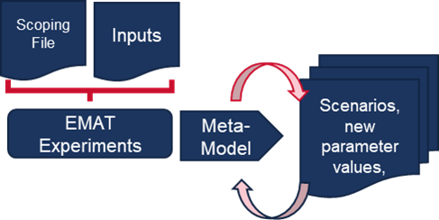
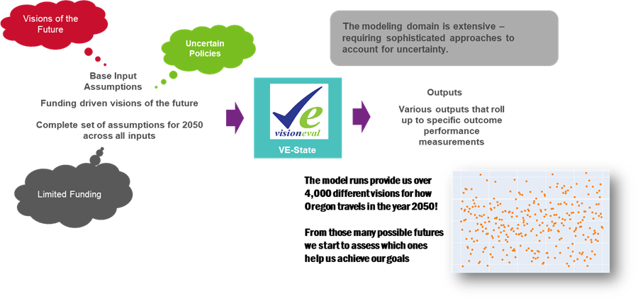
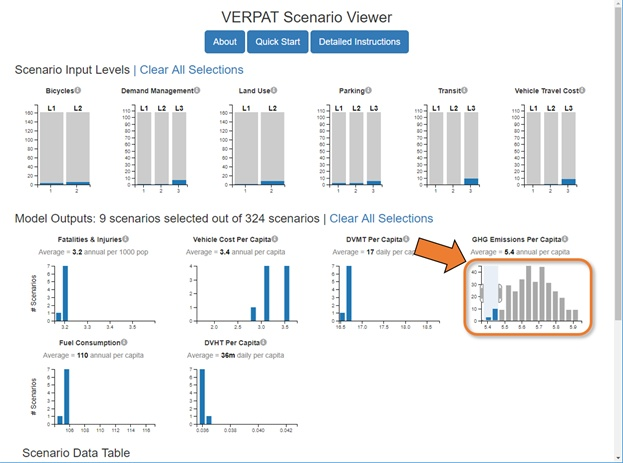

# Review Scenario Inputs and Outputs {#chapter7}

## Input Process

The inputs to each of the scenarios are to be made available to ODOT and DLCD in a format that would allow quick and efficient checking of the values and changes overtime.

Key elements to be reviewed varies by scenario:

-   Future Baseline Reference Scenario

    -   State-led inputs. Vehicle-Fuels forecast, state pricing policies, uncertainties and model-set-up are consistent with the latest Statewide VisionEval “Plans & Trends” assumptions.

    -   Local or Regional Inputs and policies. Check that local policy inputs reflect regional plans. They should also reflect realistic changes relative to prior “adopted plans” assumptions for the region, These will be used to update the Statewide VisionEval “Plans & Trends” scenario.

-   Alternative Scenarios & Target Rule Conditions

    -   State led inputs: Confirm that the state led inputs are aligned with the inputs used in the STS. Where different, are they supported by regional agreed actions to either a) push further and more aggressive than the STS or b) where more conservative there is agreement that these are to be used and more aggressive regional policies may be needed.

    -   Uncertainties. Confirm that the region is using either Baseline Reference Scenario conditions or the inputs assumptions at the time the rule was set (“TR” inputs, section 5.2/5.3) Local or Regional inputs and polices. Confirm the included policies and investments are plausible and reasonable, by comparing them to the STS assumptions for the region (Statewide VisionEval “STS Visiion” scenario inputs.

## Outputs

### Expanded Scenario Exploration Using TMIP-EMAT

*The TMIP-EMAT repository can be found here: <https://github.com/RSGInc/EMAT_VE>*

TMIP-EMAT (Travel Model Improvement Program Exploratory Modeling and Analysis Tool) was developed by FHWA with assistance from several consulting partners to identify uncertainties and interactions between transportation supply (e.g., network investments) and demand through an exploratory modeling and simulation package. Scenario planning has established methods for identifying futures and evaluating how those futures perform. A relatively new approach to scenario planning is a quantitative exploratory method known as EMA. EMA, or exploratory modeling and analysis, embraces the examination of uncertainty by explicitly treating computational experiments (i.e., models) as a set of assumptions and hypotheses and aims to explore the impacts of the assumptions on the analysis of interest. TMIP-EMAT was developed using the EMA Workbench, a tool for performing modeling and analysis, but also leveraging the ‘deep uncertainty’ framework developed by RAND.

The July 2022 publication, Transportation Planning for Uncertain Times: A Practical Guide to Decision Making Under Deep Uncertainty for MPOs provides additional insights on how TMIP-EMAT can be used with existing tools such as VisionEval. This connection between TMIP-EMAT and VisionEval leverages the strength of both tools to explore a wide range possible solutions to answer many “what if” questions. Figure 17 explains a connection between the two tools.

**Figure 17: Deep Uncertainty Using TMIP-EMAT and VisionEval**

VisionEval is the core model called within the TMIP-EMAT interface. The inputs to the VisionEval model are designed in a way to leverage the EMAT approach with inputs being a continuous interpolation between two values or whether specific VisionEval runs use a categorical (e.g., low, med, high) set of inputs. A scoping file is designed to direct the TMIP-EMAT tool in how to design the model runs and sample from the input files.

Figure 18 shows the connection between the VisionEval inputs and the scoping file which both are called by the TMIP-EMAT application. VisionEval is then run, with the number of runs dependent on the number of input dimensions and number of variables, or measures, that are being evaluated. Ideally, there should be at least three runs for each measure being evaluated in the scoping file. The VisionEval model is run 500 times to explore the range of inputs being considered.

**Figure 18: TMIP-EMAT Approach**

The 500 runs can be referred to as ‘experiments’ that form the ‘design’ which TMIP-EMAT uses the EMA Workbench to analyze using machine learning algorithms. A metamodel is produced using a set of specified output measures, which can then be used to test changes in input values without needing to run the full VisionEval model. Metamodels are regression models that estimate the VisionEval model outputs that can run quickly (seconds vs a full model run of 15 minutes).

Figure 19 shows a conceptual arrangement where VisionEval is run across the various uncertainties and levers to produce a metamodel that can explore a wide range of possible outcomes. Visually, the metamodel can produce thousands of possible scenarios to provide a wide range of uncertain futures.

**Figure 19: Concept TMIP-EMAT and VisionEval Metamodel**

The TMIP-EMAT / VisionEval process enables a unique approach to scenario planning that uses outcomes to guide the investment and input process. The quantitatively rich analysis allows a wide range of possible investments to be tested in thousands of unique combinations which would have been otherwise computationally impossible. The outputs from these combinations of inputs can be evaluated and queried to identify preferable futures (as well as futures to avoid) to better understand what investments are essential to reach our goals, as well as what investment decisions may jeopardize that possibility.

The application of the TMIP-EMAT for the region will enable a faster and more far ranging exploration of various relationships between key inputs (policies, investments) and specific outputs (VMT per capita, GHG, equity measures, mode shares).

### Interacting with Many Scenarios Using a Scenario Viewer

VsionEval has a built-in scenario viewer, which allows for assessing a large numbers of previously-run future scenarios. The VEScenarios module provides the capability to quickly set up, run, and visualize large numbers of VisionEval scenarios using a baseline scenario combined with multiple changes to model inputs. The scenario viewer will open automatically after a multi-scenario run of VisionEval is complete.

Each directory is a copy of VisionEval base model, with inputs modified as specified in the scenario\_inputs directory. Each scenario directory contains the results of a model run with its own inputs, datastore, and log file.

The VisionEval Scenario Viewer approach combines a set of inputs to produce hundreds or thousands of possible futures. Selected inputs are chosen to have multiple options, such as a high, medium or low transit service levels.

Specifying alternative values for more than one input, can quickly lead to a large number of scenarios when modeling all possible combination of the inputs. , which would take days to run. A user usually does not need all the possible combinations of scenarios. As such, VisionEval Scenarios are grouped in 5 different categories which you can modify in the category\_config.json file.

-   **Community Design**: Policies that seek to enable shorter trips and alternate modes such as promotion of mixed use land use, transit service, bicycling, and parking management.

-   **Marketing/Incentive**: Policies that improve driving efficiency such as ecodriving, and Intelligent Transportation System efforts, as well as programs that reduce auto demand such as carsharing, and home or work-based transportation demand management.

-   **Pricing:** Policies that move towards true cost pricing such as road user fees to pay for the cost of operating, maintaining and improving roads, pay-as-you-drive (PAYD) insurance, and environmental impact fees such as a carbon tax.

-   **Vehicles/Fuels**: Factors representing changes to future vehicles and fuels

-   **Income**: Context factor on the assumed growth of statewide average per capita income

With the inputs set up as correctly, the model will create the specified combination scenarios, run them, and produce a resulting dataset that drives an interactive viewer like those shown in Figure 20,

**Figure 20: Visioneval Scenario Viewer**

##### Scenario Input Levels

The top of the scenario viewer (Figure 20) shows scenario input levels by categories. Categories combine changes to multiple input files to help simplify a large number of scenarios. Categories can be defined by the user in the “category\_config.json” file. The default categories are the following:

Policy Factors: These categories represent factors within local and state control.

-   Community Design Policies that seek to enable shorter trips and alternate modes such as promotion of mixed use land use, transit service, bicycling, and parking management.

-   Marketing & Incentives Policies that improve driving efficiency such as ecodriving,and Intelligent Transportation System efforts, as well as programs that reduce auto demand such as carsharing, and home or work-based transportation demand management.

-   Pricing Policies that move towards true cost pricing such as road user fees to pay for the cost of operating, maintaining and improving roads, pay-as-you-drive (PAYD) insurance, and environmental impact fees such as a carbon tax.

-   Vehicles & Fuels Factors representing the anticipated changes to future vehicles and fuels, in addition to those resulting from existing federal and state laws, including market changes such as the shift to electric vehicles or more fuel efficient vehicles, reduced carbon intensity of fuels, pace of vehicle turnover, and the light truck share of vehicles. Since these shifts would primarily result from additional federal and state policies promoting market changes, these scenarios assume supportive local actions that advocate for more ambitious policies along with local efforts, such as installing charging stations and using landfill captured gases (renewable natural gas) to fuel buses.

Context Factors: These categories represent factors outside our control, but help evaluate the robustness of policies in the face of uncertain future conditions.

-   Fuel Price The assumed market price of gasoline and other fuels (exclusive of fuel taxes).

-   Income Growth The assumed growth of average per capita income, representing the health of the economy.

The default settings for the scenario viewer define several levels for each of the categories. These levels are numbered to indicate the amount of change from a reference case which represents the continuation of adopted local plans, policies and trends.

-   Level 1: Corresponds to the reference case.

-   Level 0: Represents a retreat from current plans (such as lower parking fees or less bicycling than anticipated), or lower context forecasts (lower fuel price or lower income).

-   Levels 2-3: Representing more ambitious policies or higher context forecasts (higher fuel price or higher income).

The levels are displayed in category bar charts, one for each Category, as shown in Figure 20. Note that the scenario viewer is also interactive. The user can select on or multiple of the scenario input levels to filter out their corresponding scenarios and data.

### Model Outputs

Given the chosen category inputs, the web page also shows future year outcomes for the several performance measures. Unlike the scenario level inputs, these performance measures are hard-coded into the scenario viewer and cannot be easily changed. The performance measures in the scenario viewer are the following:

-   GHG Target Reduction: 2005-2038 percentage reduction in light-duty vehicle GHG emissions (beyond what is anticipated to occur due to baseline assumptions regarding improvements to vehicles and fuels). RVMPO has a 2005 – 2035 state-set GHG reduction target of 19%

-   DVMT Per Capita: Daily vehicle miles of travel of residents divided by population.

-   Bike Travel Per Capita: Annual miles of resident bike travel (not including recreational travel) divided by population.

-   Walk Travel Per Capita: Annual residents’ walk trips (not including recreation or walk to transit) divided by population.

-   Air Pollution Emissions: Daily metric tons of pollutants emitted from all light-duty vehicle travel (including hydrocarbons, carbon monoxide, nitrogen dioxide, and particulates).

-   Annual Fuel Use: Annual million gallons of gasoline and other fuels consumed by all light-duty vehicle travel.

-   Annual Household Vehicle Cost: Average annual household cost (thousand dollars) for owning and operating light-duty vehicles (including gas, taxes, parking, registration, depreciation, maintenance, and financing).

-   Truck Delay: Daily vehicle-hours of delay for heavy truck travel on area roads.

Each performance measure is illustrated in a bar chart showing the range of outcome values for the selected scenarios. The bar height indicates the number of selected scenarios with that outcome value.

The model output bar charts are also interactive, and the user can select a range of values within one performance measure to see which policy choices and land use inputs result in desired outcomes. Figure 21 shows how a selection of the low end of the GHG emissions updates how many scenarios result in this outcome, as well as the respective categories of those scenarios.

The scenario data table at the bottom (not shown) also updates to show only the scenarios resulting in the selected outcome.

**Figure 21: Selecting Model OUtputs in the Scenario Viewer**

## Analyzing & Visualizing Outputs

The alternative scenarios can be evaluated using the evaluation criteria, VisionEval model, as well as other tools if available. The recommended approach is to begin with the assessment using VisionEval, then link to other desired tools that may be of interest to the region. Each alternative scenario should be evaluated based on the same evaluation criteria used in the reference case evaluation for easy comparison.

For the best results during an outreach campaign and to maximize participation it’s important to use a variety of engagement methods. Choosing strategies and elements from the alternative scenarios is an empowering activity for the public and stakeholders, and as a result, participation is likely to grow.

### Comparing scenarios

Through the early phase of the process decision-makers, stakeholders and the public will have been given an opportunity to explore and discuss the land use and transportation choices the community faces in addressing important issues over the next 20 years or more and test those choices in alternative scenarios.

Agencies can use Vision Eval to assess whether adopted plans and policies are sufficient to achieve their planning goals. If policy shifts or more ambitious actions are needed to achieve goals, VisionEval can be used to test and identify strategies which offer the most beneficial impacts. Model results can then inform the development of transportation plans and investment priorities. Vision Eval has the capacity to produce evaluation measures that metropolitan areas and local jurisdictions can use to inform future planning processes.

The evaluation criteria should be accompanied by a discussion of what is significant about the data. In particular, the differences in the scenarios should be tied to the inputs that produced the results. The best strategy is to highlight differences between the scenarios, not the absolute numbers. For example, announcing the specific VMT per capita may be too abstract for most people to understand. It is easier to visualize the meaning of those results when the evaluation is compared to the reference case and other alternative scenarios. Adding measures such as the average per capita fuel costs, transit ridership, parking costs, and active transportation utilization will go even further to making a measure such as VMT more meaningful.

### Model Outputs

Scenario Planning and Strategic Assessment with VisionEval includes output measures for a base year (e.g., 2005 and 2010), a future reference case (e.g., 2035 and/or 2050) and sensitivity tests. The modeling process provides a relatively quick regional estimate of baseline travel and its environmental implications. In addition, the reference case shows what the future will look like if the status quo continues and what various changes to the status quo could accomplish. After the completion of the model runs, the model outputs are used to develop tables and graphs which show regional outcomes for the base year, reference case, and sensitivity tests. Some outputs can also be shown at the geographic division and district levels. Working in partnership with the metropolitan area, the ODOT and DLCD staff will help to interpret the results of the model outputs and determine how best to display results.

The following measures are available.

**Household & Transport Attributes**

-   Population and Household size

-   Land use by development type

-   Population in mixed-use neighborhoods

-   Vehicles ( type, powertrain, efficiency)

-   Household travel costs (fuel, auto ownership, gas taxes, parking, social)

**Travel**

-   Household daily VMT (total and per capita)

-   Bike/Light Vehicle miles, Pedestrian & Transit trips

-   Transit service level

-   Vehicle delay (total and per capita)

**Fuel & GHG Emissions**

-   Auto fuel & electricity consumed

-   Greenhouse gasses produced

-   Other – criteria air pollution, household water use

### Visualizing outputs

Visualizing the preferred scenarios and alternative scenarios can be produced by data outputs, and from creating graphics using spreadsheet and illustration software, or other methods.

Outputs can be visualized with the help of a vision document that captures the community goals expressed during the planning process, and describes the anticipated outcomes based on the selected scenario. Outputs can also be visualized through an online interactive scenario viewer if resources and capacity are available to support the effort as part of the planning process.

**Figure 22: Example Graphic of Scenario Evaluation Results**

**Figure 23: Example of Scenario Viewer**

